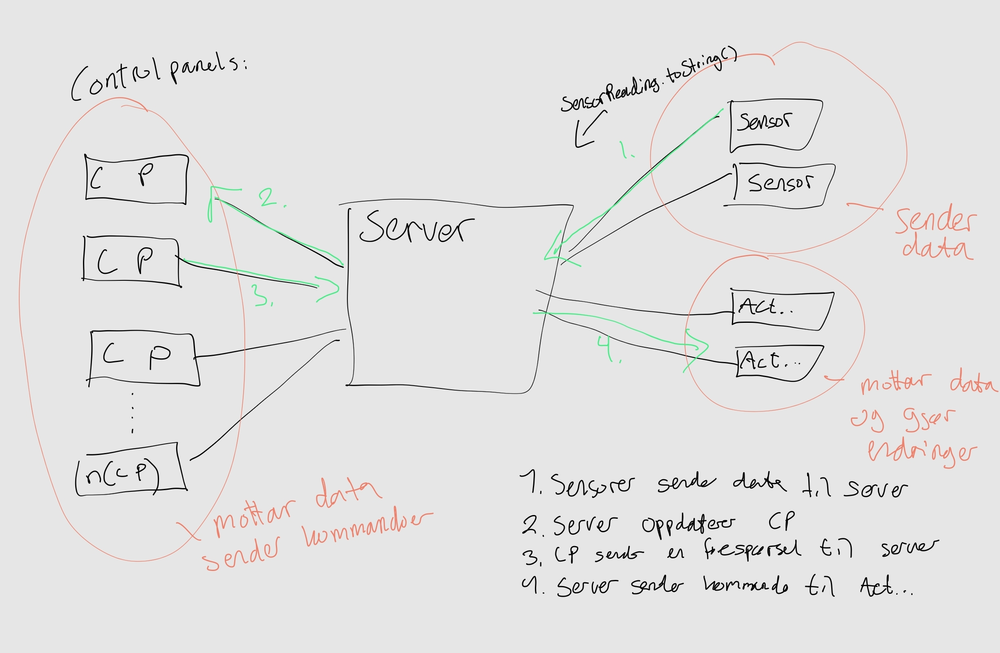

# Project in IDATA2304 Computer Communication and Network Programming

To run the application, either:
- Run the following line of code: "mvn javafx:run"
- Or run the "GreenhouseGuiStarter" - class

A visualization of how the communication could possibly look like:

